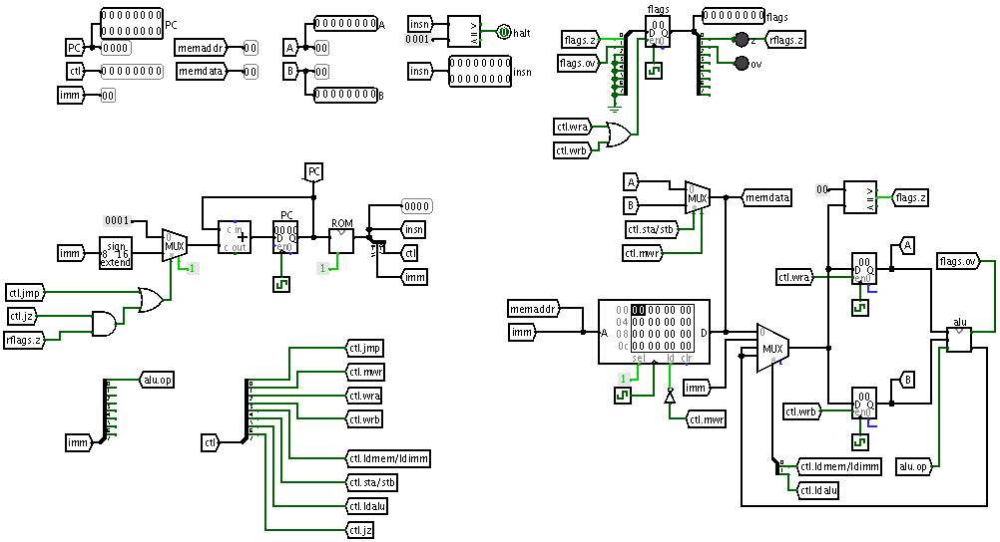

## Overview of the processor

## Sample program

    # fibornacci numbers
    #
    # a, b = 1, 2
    # a, b = b, a + b
    #
    
    imma 10
    sta 2   # @2: count
    
    imma 1  # @0: a
    sta 0
    
    imma 2  # @1: b
    sta 1
    
    # loop
    lda 0
    ldb 1
    add
    sta 1   # b = a + b
    stb 0   # a = b
    lda 2
    immb 1
    sub     # count -= 1
    sta 2
    jz 2    # break
    jmp -10 # goto loop
    
    # end
    hlt

## Program output

Fiibonacci numbers in register A

    pc: 0x000a i: 0x0022 I: stb 0x00   f: [    ] a: 0x03 b: 0x02
    pc: 0x000a i: 0x0022 I: stb 0x00   f: [    ] a: 0x05 b: 0x03
    pc: 0x000a i: 0x0022 I: stb 0x00   f: [    ] a: 0x08 b: 0x05
    pc: 0x000a i: 0x0022 I: stb 0x00   f: [    ] a: 0x0d b: 0x08
    pc: 0x000a i: 0x0022 I: stb 0x00   f: [    ] a: 0x15 b: 0x0d
    pc: 0x000a i: 0x0022 I: stb 0x00   f: [    ] a: 0x22 b: 0x15
    pc: 0x000a i: 0x0022 I: stb 0x00   f: [    ] a: 0x37 b: 0x22
    pc: 0x000a i: 0x0022 I: stb 0x00   f: [    ] a: 0x59 b: 0x37
    pc: 0x000a i: 0x0022 I: stb 0x00   f: [    ] a: 0x90 b: 0x59
    pc: 0x000a i: 0x0022 I: stb 0x00   f: [    ] a: 0xe9 b: 0x90

## Full trace
    
    pc: 0x0000 i: 0x0a14 I: imma 0x0a  f: [    ] a: 0x00 b: 0x00
    pc: 0x0001 i: 0x0202 I: sta 0x02   f: [    ] a: 0x0a b: 0x00
    pc: 0x0002 i: 0x0114 I: imma 0x01  f: [    ] a: 0x0a b: 0x00
    pc: 0x0003 i: 0x0002 I: sta 0x00   f: [    ] a: 0x01 b: 0x00
    pc: 0x0004 i: 0x0214 I: imma 0x02  f: [    ] a: 0x01 b: 0x00
    pc: 0x0005 i: 0x0102 I: sta 0x01   f: [    ] a: 0x02 b: 0x00
    pc: 0x0006 i: 0x0004 I: lda 0x00   f: [    ] a: 0x02 b: 0x00
    pc: 0x0007 i: 0x0108 I: ldb 0x01   f: [    ] a: 0x01 b: 0x00
    pc: 0x0008 i: 0x0044 I: add        f: [    ] a: 0x01 b: 0x02
    pc: 0x0009 i: 0x0102 I: sta 0x01   f: [    ] a: 0x03 b: 0x02
    pc: 0x000a i: 0x0022 I: stb 0x00   f: [    ] a: 0x03 b: 0x02
    pc: 0x000b i: 0x0204 I: lda 0x02   f: [    ] a: 0x03 b: 0x02
    pc: 0x000c i: 0x0118 I: immb 0x01  f: [    ] a: 0x0a b: 0x02
    pc: 0x000d i: 0x0144 I: sub        f: [    ] a: 0x0a b: 0x01
    pc: 0x000e i: 0x0202 I: sta 0x02   f: [    ] a: 0x09 b: 0x01
    pc: 0x000f i: 0x0280 I: jz 0x02    f: [    ] a: 0x09 b: 0x01
    pc: 0x0010 i: 0xf601 I: jmp 0x-a   f: [    ] a: 0x09 b: 0x01
    pc: 0x0006 i: 0x0004 I: lda 0x00   f: [    ] a: 0x09 b: 0x01
    pc: 0x0007 i: 0x0108 I: ldb 0x01   f: [    ] a: 0x02 b: 0x01
    pc: 0x0008 i: 0x0044 I: add        f: [    ] a: 0x02 b: 0x03
    pc: 0x0009 i: 0x0102 I: sta 0x01   f: [    ] a: 0x05 b: 0x03
    pc: 0x000a i: 0x0022 I: stb 0x00   f: [    ] a: 0x05 b: 0x03
    pc: 0x000b i: 0x0204 I: lda 0x02   f: [    ] a: 0x05 b: 0x03
    pc: 0x000c i: 0x0118 I: immb 0x01  f: [    ] a: 0x09 b: 0x03
    pc: 0x000d i: 0x0144 I: sub        f: [    ] a: 0x09 b: 0x01
    pc: 0x000e i: 0x0202 I: sta 0x02   f: [    ] a: 0x08 b: 0x01
    pc: 0x000f i: 0x0280 I: jz 0x02    f: [    ] a: 0x08 b: 0x01
    pc: 0x0010 i: 0xf601 I: jmp 0x-a   f: [    ] a: 0x08 b: 0x01
    pc: 0x0006 i: 0x0004 I: lda 0x00   f: [    ] a: 0x08 b: 0x01
    pc: 0x0007 i: 0x0108 I: ldb 0x01   f: [    ] a: 0x03 b: 0x01
    pc: 0x0008 i: 0x0044 I: add        f: [    ] a: 0x03 b: 0x05
    pc: 0x0009 i: 0x0102 I: sta 0x01   f: [    ] a: 0x08 b: 0x05
    pc: 0x000a i: 0x0022 I: stb 0x00   f: [    ] a: 0x08 b: 0x05
    pc: 0x000b i: 0x0204 I: lda 0x02   f: [    ] a: 0x08 b: 0x05
    pc: 0x000c i: 0x0118 I: immb 0x01  f: [    ] a: 0x08 b: 0x05
    pc: 0x000d i: 0x0144 I: sub        f: [    ] a: 0x08 b: 0x01
    pc: 0x000e i: 0x0202 I: sta 0x02   f: [    ] a: 0x07 b: 0x01
    pc: 0x000f i: 0x0280 I: jz 0x02    f: [    ] a: 0x07 b: 0x01
    pc: 0x0010 i: 0xf601 I: jmp 0x-a   f: [    ] a: 0x07 b: 0x01
    pc: 0x0006 i: 0x0004 I: lda 0x00   f: [    ] a: 0x07 b: 0x01
    pc: 0x0007 i: 0x0108 I: ldb 0x01   f: [    ] a: 0x05 b: 0x01
    pc: 0x0008 i: 0x0044 I: add        f: [    ] a: 0x05 b: 0x08
    pc: 0x0009 i: 0x0102 I: sta 0x01   f: [    ] a: 0x0d b: 0x08
    pc: 0x000a i: 0x0022 I: stb 0x00   f: [    ] a: 0x0d b: 0x08
    pc: 0x000b i: 0x0204 I: lda 0x02   f: [    ] a: 0x0d b: 0x08
    pc: 0x000c i: 0x0118 I: immb 0x01  f: [    ] a: 0x07 b: 0x08
    pc: 0x000d i: 0x0144 I: sub        f: [    ] a: 0x07 b: 0x01
    pc: 0x000e i: 0x0202 I: sta 0x02   f: [    ] a: 0x06 b: 0x01
    pc: 0x000f i: 0x0280 I: jz 0x02    f: [    ] a: 0x06 b: 0x01
    pc: 0x0010 i: 0xf601 I: jmp 0x-a   f: [    ] a: 0x06 b: 0x01
    pc: 0x0006 i: 0x0004 I: lda 0x00   f: [    ] a: 0x06 b: 0x01
    pc: 0x0007 i: 0x0108 I: ldb 0x01   f: [    ] a: 0x08 b: 0x01
    pc: 0x0008 i: 0x0044 I: add        f: [    ] a: 0x08 b: 0x0d
    pc: 0x0009 i: 0x0102 I: sta 0x01   f: [    ] a: 0x15 b: 0x0d
    pc: 0x000a i: 0x0022 I: stb 0x00   f: [    ] a: 0x15 b: 0x0d
    pc: 0x000b i: 0x0204 I: lda 0x02   f: [    ] a: 0x15 b: 0x0d
    pc: 0x000c i: 0x0118 I: immb 0x01  f: [    ] a: 0x06 b: 0x0d
    pc: 0x000d i: 0x0144 I: sub        f: [    ] a: 0x06 b: 0x01
    pc: 0x000e i: 0x0202 I: sta 0x02   f: [    ] a: 0x05 b: 0x01
    pc: 0x000f i: 0x0280 I: jz 0x02    f: [    ] a: 0x05 b: 0x01
    pc: 0x0010 i: 0xf601 I: jmp 0x-a   f: [    ] a: 0x05 b: 0x01
    pc: 0x0006 i: 0x0004 I: lda 0x00   f: [    ] a: 0x05 b: 0x01
    pc: 0x0007 i: 0x0108 I: ldb 0x01   f: [    ] a: 0x0d b: 0x01
    pc: 0x0008 i: 0x0044 I: add        f: [    ] a: 0x0d b: 0x15
    pc: 0x0009 i: 0x0102 I: sta 0x01   f: [    ] a: 0x22 b: 0x15
    pc: 0x000a i: 0x0022 I: stb 0x00   f: [    ] a: 0x22 b: 0x15
    pc: 0x000b i: 0x0204 I: lda 0x02   f: [    ] a: 0x22 b: 0x15
    pc: 0x000c i: 0x0118 I: immb 0x01  f: [    ] a: 0x05 b: 0x15
    pc: 0x000d i: 0x0144 I: sub        f: [    ] a: 0x05 b: 0x01
    pc: 0x000e i: 0x0202 I: sta 0x02   f: [    ] a: 0x04 b: 0x01
    pc: 0x000f i: 0x0280 I: jz 0x02    f: [    ] a: 0x04 b: 0x01
    pc: 0x0010 i: 0xf601 I: jmp 0x-a   f: [    ] a: 0x04 b: 0x01
    pc: 0x0006 i: 0x0004 I: lda 0x00   f: [    ] a: 0x04 b: 0x01
    pc: 0x0007 i: 0x0108 I: ldb 0x01   f: [    ] a: 0x15 b: 0x01
    pc: 0x0008 i: 0x0044 I: add        f: [    ] a: 0x15 b: 0x22
    pc: 0x0009 i: 0x0102 I: sta 0x01   f: [    ] a: 0x37 b: 0x22
    pc: 0x000a i: 0x0022 I: stb 0x00   f: [    ] a: 0x37 b: 0x22
    pc: 0x000b i: 0x0204 I: lda 0x02   f: [    ] a: 0x37 b: 0x22
    pc: 0x000c i: 0x0118 I: immb 0x01  f: [    ] a: 0x04 b: 0x22
    pc: 0x000d i: 0x0144 I: sub        f: [    ] a: 0x04 b: 0x01
    pc: 0x000e i: 0x0202 I: sta 0x02   f: [    ] a: 0x03 b: 0x01
    pc: 0x000f i: 0x0280 I: jz 0x02    f: [    ] a: 0x03 b: 0x01
    pc: 0x0010 i: 0xf601 I: jmp 0x-a   f: [    ] a: 0x03 b: 0x01
    pc: 0x0006 i: 0x0004 I: lda 0x00   f: [    ] a: 0x03 b: 0x01
    pc: 0x0007 i: 0x0108 I: ldb 0x01   f: [    ] a: 0x22 b: 0x01
    pc: 0x0008 i: 0x0044 I: add        f: [    ] a: 0x22 b: 0x37
    pc: 0x0009 i: 0x0102 I: sta 0x01   f: [    ] a: 0x59 b: 0x37
    pc: 0x000a i: 0x0022 I: stb 0x00   f: [    ] a: 0x59 b: 0x37
    pc: 0x000b i: 0x0204 I: lda 0x02   f: [    ] a: 0x59 b: 0x37
    pc: 0x000c i: 0x0118 I: immb 0x01  f: [    ] a: 0x03 b: 0x37
    pc: 0x000d i: 0x0144 I: sub        f: [    ] a: 0x03 b: 0x01
    pc: 0x000e i: 0x0202 I: sta 0x02   f: [    ] a: 0x02 b: 0x01
    pc: 0x000f i: 0x0280 I: jz 0x02    f: [    ] a: 0x02 b: 0x01
    pc: 0x0010 i: 0xf601 I: jmp 0x-a   f: [    ] a: 0x02 b: 0x01
    pc: 0x0006 i: 0x0004 I: lda 0x00   f: [    ] a: 0x02 b: 0x01
    pc: 0x0007 i: 0x0108 I: ldb 0x01   f: [    ] a: 0x37 b: 0x01
    pc: 0x0008 i: 0x0044 I: add        f: [    ] a: 0x37 b: 0x59
    pc: 0x0009 i: 0x0102 I: sta 0x01   f: [    ] a: 0x90 b: 0x59
    pc: 0x000a i: 0x0022 I: stb 0x00   f: [    ] a: 0x90 b: 0x59
    pc: 0x000b i: 0x0204 I: lda 0x02   f: [    ] a: 0x90 b: 0x59
    pc: 0x000c i: 0x0118 I: immb 0x01  f: [    ] a: 0x02 b: 0x59
    pc: 0x000d i: 0x0144 I: sub        f: [    ] a: 0x02 b: 0x01
    pc: 0x000e i: 0x0202 I: sta 0x02   f: [    ] a: 0x01 b: 0x01
    pc: 0x000f i: 0x0280 I: jz 0x02    f: [    ] a: 0x01 b: 0x01
    pc: 0x0010 i: 0xf601 I: jmp 0x-a   f: [    ] a: 0x01 b: 0x01
    pc: 0x0006 i: 0x0004 I: lda 0x00   f: [    ] a: 0x01 b: 0x01
    pc: 0x0007 i: 0x0108 I: ldb 0x01   f: [    ] a: 0x59 b: 0x01
    pc: 0x0008 i: 0x0044 I: add        f: [    ] a: 0x59 b: 0x90
    pc: 0x0009 i: 0x0102 I: sta 0x01   f: [    ] a: 0xe9 b: 0x90
    pc: 0x000a i: 0x0022 I: stb 0x00   f: [    ] a: 0xe9 b: 0x90
    pc: 0x000b i: 0x0204 I: lda 0x02   f: [    ] a: 0xe9 b: 0x90
    pc: 0x000c i: 0x0118 I: immb 0x01  f: [    ] a: 0x01 b: 0x90
    pc: 0x000d i: 0x0144 I: sub        f: [    ] a: 0x01 b: 0x01
    pc: 0x000e i: 0x0202 I: sta 0x02   f: [z   ] a: 0x00 b: 0x01
    pc: 0x000f i: 0x0280 I: jz 0x02    f: [z   ] a: 0x00 b: 0x01
    pc: 0x0011 i: 0x0001 I: hlt        f: [z   ] a: 0x00 b: 0x01
